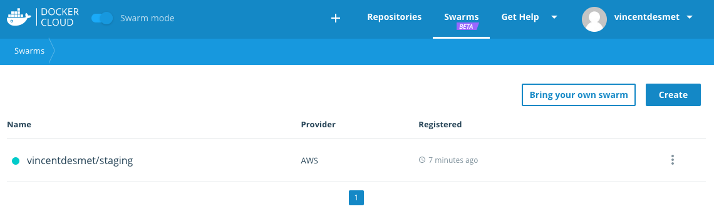
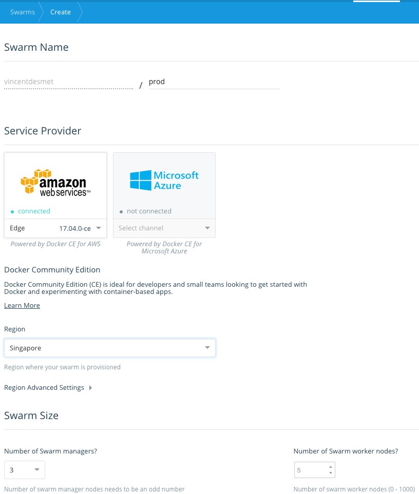
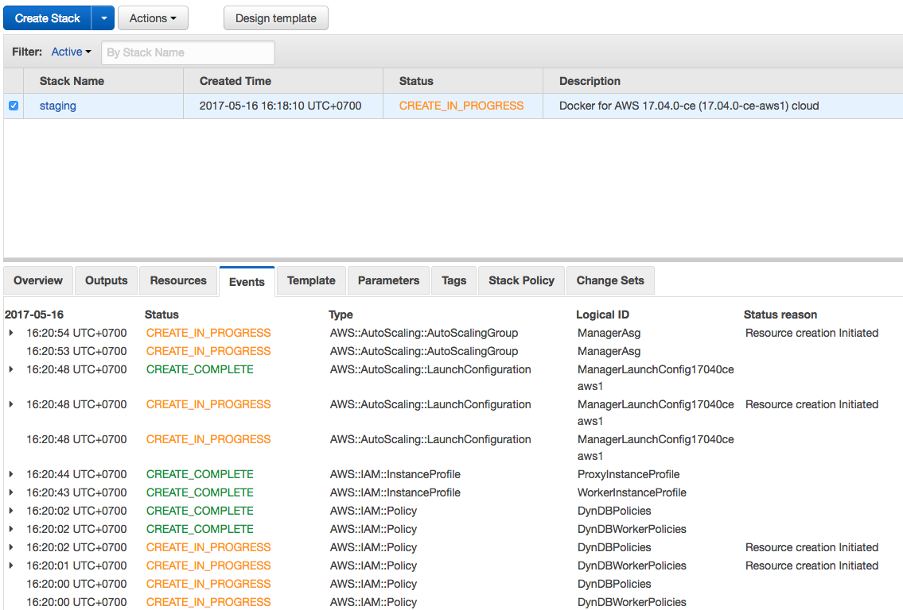

# DockerCon 2017 Recap

[gist](https://gist.github.com/so0k/4a4378eb76aea2217a219ec78b03acf5)

## Docker for Developers

### Docker Multi Stage builds
At the time of writing, need to install Docker For Mac Edge

Sample application: [alexellis2/href-counter](https://github.com/alexellis/href-counter)

> A Golang example application which counts internal vs. external hrefs within a page to rate SEO.

```bash
docker run --rm -e url=https://news.ycombinator.com alexellis2/href-counter
```
**Note**: Needs internet to get html from url...

## Before Multi Stage builds:

Build sdk image
```
docker build -t alexellis2/href-counter:sdk . -f Dockerfile.build
```

Look at size of image
```
docker images |grep href-counter
```

Size of layers added ~20MB
```bash
docker history alexellis2/href-counter:sdk |head -n 4
```

Use builder pattern:
```bash
cat build.sh
```

Now run old builder pattern
```bash
./build.sh
```

Confirm new final image is much smaller
```bash
docker images |grep href-counter
```

## With Multi-stage builds

Instead of using a shell script to orchestrate two separate Dockerfiles, we can just use one and define stages throughout.

```bash
cat Dockerfile.multi
```

Sample Hello world app
```bash
cd ../hello
docker build -t hello-world-lab .
```

Resulting image is very small
```bash
docker images |grep hello-world-lab
```

Confirm image works
```bash
docker run --rm hello-world-lab
```

### Desktop to Cloud

- [Docker Cloud UI](https://cloud.docker.com/swarm/vincentdesmet/swarm/list/1?page_size=10) (takes about 10min)
- [AWS Stacks](https://ap-southeast-1.console.aws.amazon.com/cloudformation/home?region=ap-southeast-1#/stacks)







Setting up Docker cloud [instructions](https://docs.docker.com/docker-cloud/cloud-swarm/link-aws-swarm/#attach-a-policy-for-legacy-aws-links)

## Docker For Operators

Overview of all components making up Docker stack.

Highlights:

- [secrets](secrets/).
- Node identity, MTLS and encrypted networking
- LinuxKit
- Moby


